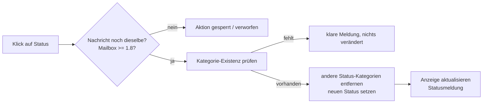

# Benedict Precision Workspace – Outlook Command Center

> **Kurz:** Outlook-Add-in, das Mails mit einem Klick genau **einen** Bearbeitungsstatus gibt – ohne Löschen, Verschieben oder Senden, ohne Tracking, mit minimaler Berechtigung. Version 1.0.0, geprüft durch Validator, Logik-Tests und 39 Browser-E2E-Prüfungen.

**Problem:** Im Posteingang fehlt ein schneller, einheitlicher Weg, Mails nach „selbst erledigen / wartet / Projekt / erledigt / Referenz“ zu sortieren. Kategorien gibt es in Outlook, aber mehrere Status-Kategorien gleichzeitig führen zu Chaos. Das Add-in erzwingt genau einen Status und lässt fachliche Kategorien unberührt.

Persönliches Outlook-Add-in (Aufgabenbereich) für den **Benedict Precision Workspace**.
Es zeigt für die geöffnete Nachricht Absender, Betreff und Kategorien und setzt per Klick genau **einen Status**:

| Knopf | Wirkung |
|---|---|
| ACTION | Kategorie ACTION setzen, andere Status-Kategorien entfernen |
| WAITING | Kategorie WAITING setzen, andere Status-Kategorien entfernen |
| PROJECT | Kategorie PROJECT setzen, andere Status-Kategorien entfernen |
| DONE | Kategorie DONE setzen (kein Archivieren, kein Löschen) |
| REFERENCE | Kategorie REFERENCE setzen (kein Verschieben, kein Löschen) |

Nochmal klicken = Status entfernen. Fachliche Kategorien (z. B. CAREER, FINANCE, PRIVATE) bleiben unberührt.
Voraussetzung: Die fünf Kategorien existieren in Outlook (Einstellungen → Konten → Kategorien).

## Architektur
- Statische Seite in `site/` → GitHub Pages (HTTPS), Deployment nur über GitHub Actions nach Validierung
- Einzige externe Datei: Office.js von Microsoft
- Berechtigung: `ReadWriteItem` (siehe PERMISSIONS.md)
- Keine Analytics, kein Tracking, keine Web-Fonts, keine Bibliotheken von Drittanbietern
- Visual: „Precision Lattice“ in CSS-2.5D, 9-s-Zyklus mit 86 % Ruhe; läuft nur, solange Zeiger/Fokus im Bereich sind; `prefers-reduced-motion` und Schalter „Bewegung: reduziert“

## Struktur
```
manifest.production.xml   Outlook-Manifest (XML, nur Add-in)
site/                     veröffentlichte Dateien (taskpane, logic, commands, support, assets)
tests/logic.test.js       Tests der Status-Logik (node --test)
tools/validate_repo.py    Harte Prüfungen (VALIDATION PASS nötig)
tools/set_owner.py        GitHub-Benutzer ins Manifest eintragen
tools/make_icons.py       Icons erzeugen
.github/workflows/        Pages, Validate, CodeQL (Actions auf Commit-SHA gepinnt)
tests/e2e/                E2E-Tests (Playwright) mit Office.js-Attrappe
docs/                     Härtung, Red Team, Installation, Recherche, Plattform
```

## Prüfen
```
python3 tools/validate_repo.py
node --test tests/logic.test.js
python3 tests/e2e/run_e2e.py     # Playwright, Office.js-Attrappe mit fiktiven Daten
```

## Installation in Outlook
Siehe `docs/INSTALL-OUTLOOK.md`. Entfernen: `ROLLBACK.md`. Änderungen: `CHANGELOG.md`.

## Ablauf eines Klicks



## Tests im Detail
| Prüfung | Befehl | Stand 1.0.0 |
|---|---|---|
| Repository-Validator (Manifest, CSP, verbotene APIs, Token-Muster, Workflows) | `python3 tools/validate_repo.py` | VALIDATION PASS |
| Status-Logik | `node --test tests/logic.test.js` | 8/8 |
| Browser-E2E mit Office.js-Attrappe und fiktiven Daten (Nachrichtenwechsel, Wettläufe, Breiten 280–480 px, Reduced Motion) | `python3 tests/e2e/run_e2e.py` (Playwright + Chromium) | 39/39 |

Screenshots in `SCREENSHOTS/` erzeugt: `python3 tests/e2e/run_e2e.py --shots SCREENSHOTS` – ausschließlich fiktive Demo-Daten.

## Sicherheit und Datenschutz
Kurzfassung: keine Netzwerk-APIs im eigenen Code, Ausgabe nur per `textContent`, keine Drittbibliotheken, nur `ReadWriteItem`, Actions auf Commit-SHA gepinnt. Details: [SECURITY.md](SECURITY.md), [PERMISSIONS.md](PERMISSIONS.md).

## Grenzen
- Outlook.com unterstützt kein Pinning: Der Bereich folgt der Nachrichtenauswahl dort nicht (Microsoft-365-Konten schon).
- Die fünf Status-Kategorien müssen in Outlook angelegt sein.
- Office.js wird zur Laufzeit von Microsoft geladen.

## Lizenz
Noch keine Lizenz gewählt – bis dahin alle Rechte beim Autor.

